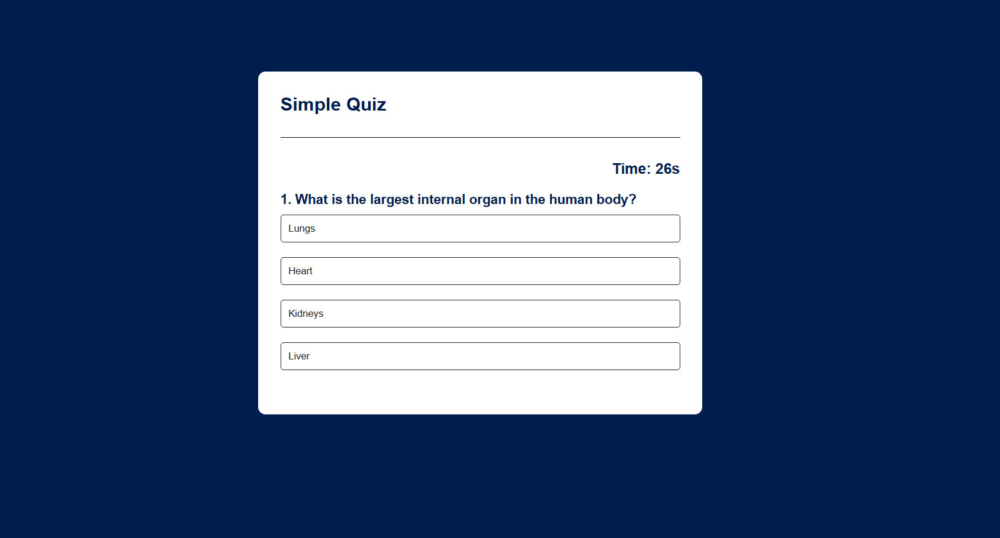
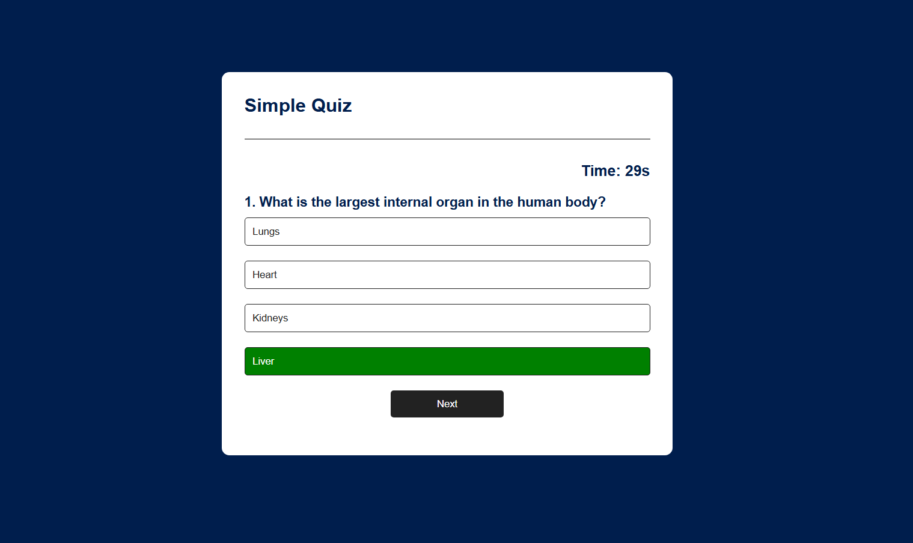

# 🧠 Quiz Web App

A simple and interactive **Quiz Web Application** built using **HTML, CSS, and JavaScript**.  
The quiz displays multiple-choice questions with a **30-second timer** for each question and shows the final score at the end.

---

## 🚀 Live Demo

👉 [Click here to play the quiz]( https://rtulu-reddy.github.io/Quiz-App/)  
---

## 📸 Screenshots

| Homepage | Question Screen | Result Screen |
|-----------|------------------|---------------|
|  |  |  |


---

## 🧩 Features

- 30-second timer for each question  
- Auto-next question when time runs out  
- Live score tracking  
- Clean, responsive UI  
- Restart quiz option  

---

## ⚙️ Technologies Used

- **HTML5** — Structure and layout  
- **CSS3** — Styling and responsiveness  
- **JavaScript (ES6)** — Logic and timer functionality  
- **VS Code** — Code editor  
- **GitHub Pages** — Hosting the quiz online  

---

## 🧠 Learning Outcomes

- Understanding of DOM manipulation  
- Working with timers using `setInterval()`  
- Building interactive UI using JavaScript  
- Styling using CSS Flexbox and transitions  

---

## 🛠️ How to Run Locally

1. Clone this repository:
   ```bash
   git clone https://github.com/rtulu-reddy/Quiz-App.git

2. Open the folder:
    -cd quiz-app

3. Run the app:
    -Just open index.html in any browser.

---    

🔮 Future Enhancements

- Add a start button before quiz begins

- Add categories and difficulty levels

- Store scores using localStorage

- Build a backend (Node.js + MongoDB) for tracking users  

---

🙏 Acknowledgments

- MDN Web Docs

- W3Schools

---

👤 Author

Name: [R Tulu Reddy]
Regd No: [2301109160]
Branch: CSE
College: [PMEC]